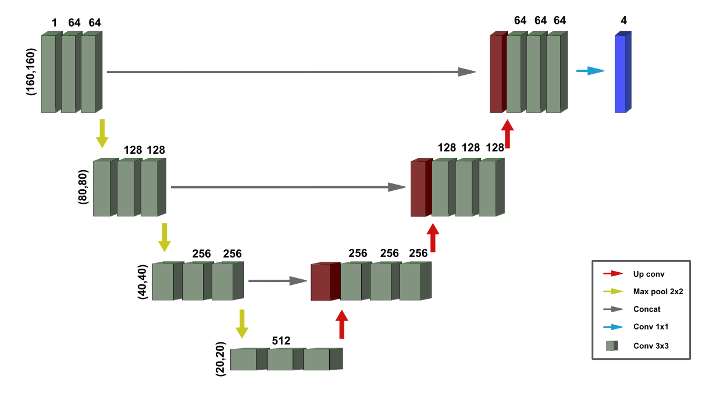
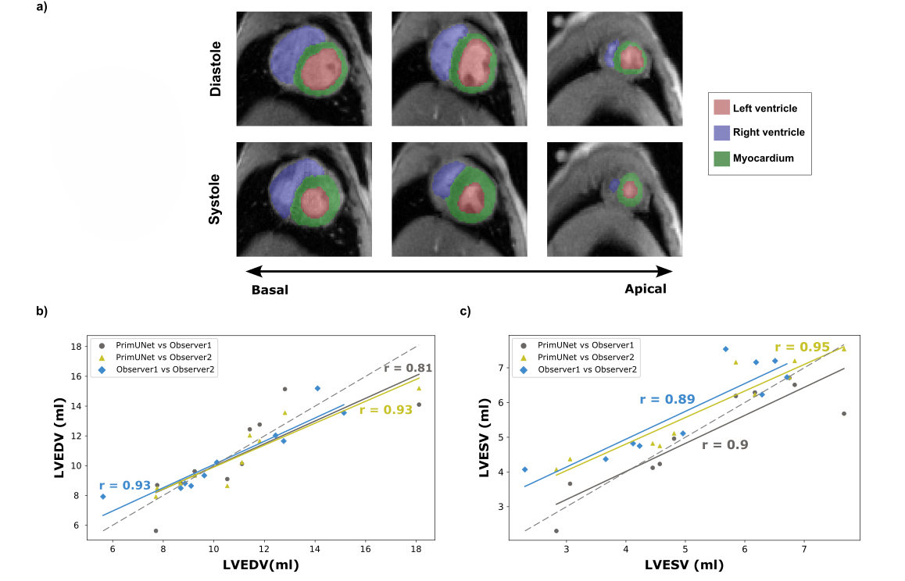

# UNet Cardiac Segmentation

## Deep Learning-Based Automated Segmentation of Cardiac 2D MRI

This repository contains the implementation of **PrimUNet**, a fully automated deep learning framework for the segmentation of cardiac structures in **2D Cardiac MRI**.

The model is based on the **U-Net architecture** and performs pixel-wise segmentation of the:

- Left ventricle (LV)
- Right ventricle (RV)
- Myocardium

---

## Publication

Further details on the research and the underlying open question are available in:

**Ramedani, M., Moussavi, A., Memhave, T. R., & Boretius, S. (2025).**  
*Deep learning-based automated segmentation of cardiac real-time MRI in non-human primates.*  
**Computers in Biology and Medicine**

**DOI:** https://doi.org/10.1016/j.compbiomed.2025.109894

---

## Abstract

Cardiovascular magnetic resonance imaging (MRI) provides valuable information for assessing cardiac structure and function. However, manual segmentation of cardiac structures is time-consuming and subject to observer variability, highlighting the need for reliable and automated segmentation approaches.

This study developed **PrimUNet**, a fully automated 2D convolutional neural network based on the **U-Net architecture** for segmenting the left ventricle, right ventricle, and myocardium.

---

## 2D U-Net Model Architecture

We implemented a **2D U-Net architecture** for automated cardiac image segmentation.

The model implementation can be found in the [`src`](src) directory.

  

---

## Results

The following figure shows representative segmentation results and a comparison between the trained U-Net model and two independent human observers.

  

The model achieved an **average Dice score of approximately 0.90**, demonstrating segmentation performance comparable to human observers.

---

## Key Findings

- Fully automated segmentation of cardiac structures from 2D MRI
- Segmentation of the **left ventricle, right ventricle, and myocardium**
- **Average Dice score: 0.90**
- Strong agreement with manual measurements of:
  - Left ventricular volume
  - Myocardial volume
- Performance comparable to human observers

---

## Repository Structure
.
├── Images/
├── Preprocessing/
├── src/  
└── README.md
